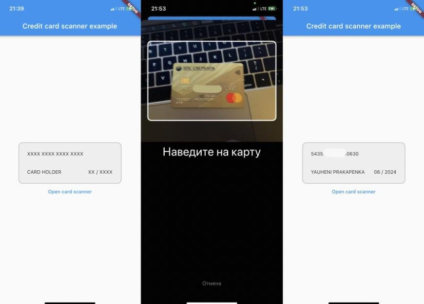
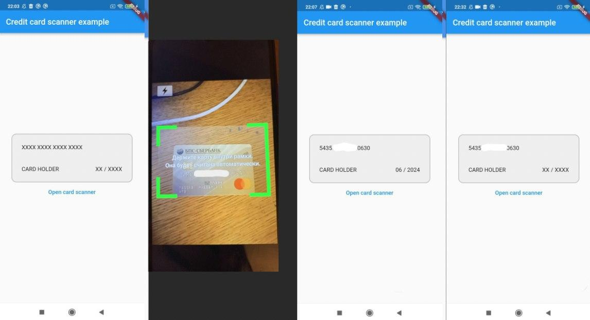

# Flutter Credit Card Scanner

Плагин для сканирования кредитной карты для Android и iOS.

## iOS

<p align="center">
  <p style="text-align:center;">
</p>

Используется библиотека [CreditCardScanner](https://github.com/yhkaplan/credit-card-scanner), которая работает
с Apple's Vision API, начиная с версии `iOS 13.0` и выше.

## Android

<p align="center">
  <p style="text-align:center;">
</p>

Используется библиотека [card.io](https://github.com/card-io/card.io-Android-SDK), начиная с `Android 4.1` и выше.

## Как это настроено

### iOS

- Для `info.plist` добавлено разрешение на камеру
```
<key>NSCameraUsageDescription</key>
<string>Приложение запрашивает доступ к камере для автоматического сканирования карты</string>
```
- Добавлена библиотека

credit_card_scanner/example/ios/Runner.xcworkspace -> в навигации Runnter -> справа Project Runner -> Packages Dependencies -> +

```
https://github.com/yhkaplan/credit-card-scanner.git
```

- Установлены CocoaPods
```
cd example/ios
pod install
```

### Android

- В android/app/build.gradle добавлено две зависимости
```
dependencies {
    implementation 'io.card:android-sdk:5.5.1'        
    implementation 'com.google.code.gson:gson:2.8.9'
}
```